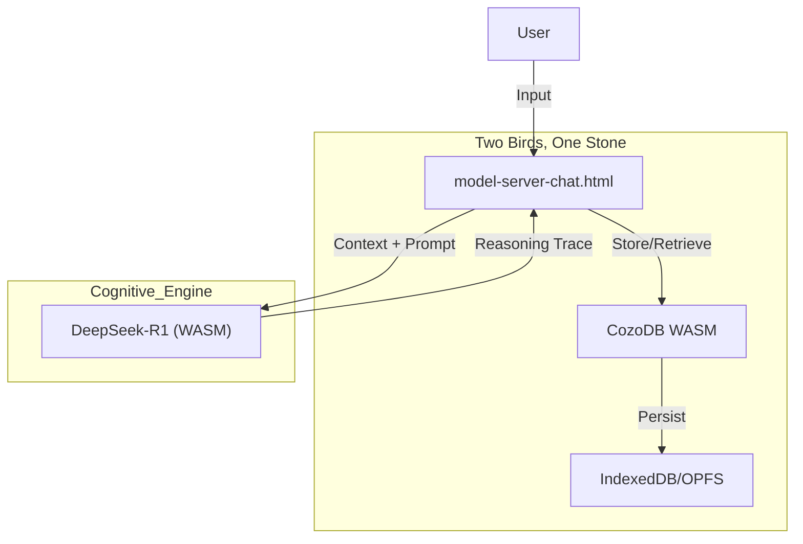

# Context Information Engine (Sovereign Edition)

> **Philosophy:** Your mind, augmented. Your data, sovereign. Your tools, open.

A **Browser-Native** cognitive extraction system. No servers. No cloud. No installation.
Just you, your browser, and your infinite context.

---

## ⚡ Quick Start

1.  **Download** this repository.
2.  **Open** `tools/index.html` in Chrome or Edge.
3.  **Click** "Double Click to Launch" on the Console.

*That's it. You are running a local LLM with persistent Graph Memory.*

---

## 🏗️ Architecture

The system runs entirely in `tools/` using WebAssembly (WASM).

### 1. The Sovereign Loop

### 2. Core Components
*   **Brain**: `model-server-chat.html` - Runs the Graph-R1 Reasoning Loop.
*   **Memory**: `CozoDB (WASM)` - Stores relations (`*memory`) and vectors. Persists to browser IndexedDB.
*   **Stomach**: `sovereign-db-builder.html` - Ingests files (Markdown/JSON) into the graph.

---

## 📚 Documentation

*   **Architecture**: [specs/spec.md](specs/spec.md)
*   **Roadmap**: [specs/plan.md](specs/plan.md)
*   **Memory Schema**: [specs/architecture/memory-layer.spec.md](specs/architecture/memory-layer.spec.md)
*   **WASM Layer**: [specs/architecture/sovereign-wasm.spec.md](specs/architecture/sovereign-wasm.spec.md)

---

## 🧹 Legacy Support
The old Python/Neo4j backend has been **archived**.
*   Legacy README: [archive/v1_python_backend/README_LEGACY.md](archive/v1_python_backend/README_LEGACY.md)
*   Legacy Code: `archive/v1_python_backend/`