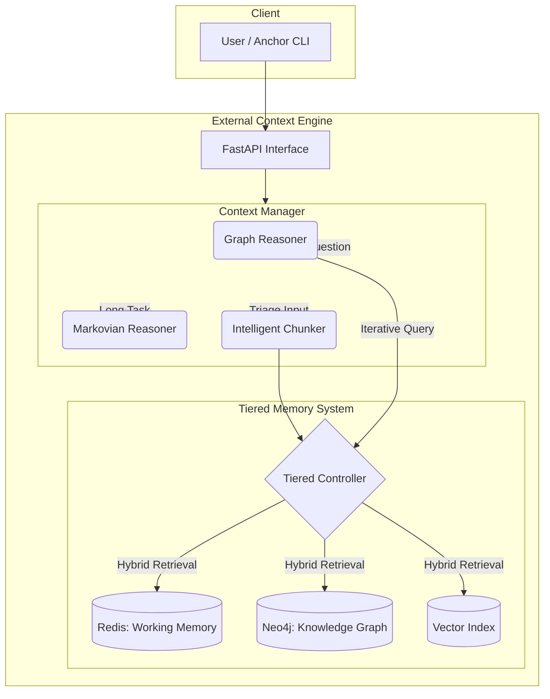

[2025-11-25] Architecture Update: ECE_Core Implementation.

We have moved from the theoretical "Project Chimaera" design to the concrete "ECE_Core" implementation. The core principles remain, but the specific mechanisms have evolved to leverage modern Agentic patterns (Graph-R1) and Hybrid Retrieval.

Here is the updated architectural blueprint.

-----

### **ECE_Core: Cognitive Architecture - Status Report**

**System:** External Context Engine (ECE) | **Report Timestamp:** 2025-11-25
**Overall Status:** **Operational Beta** - Graph Ingestion & Reasoning Active

-----

### 🚀 Current Status & Achieved Architecture

We have successfully built the **External Context Engine (ECE)**, a standalone cognitive server that acts as an "Infinite Memory" hippocampus for LLMs.

#### **Current Functioning Data Pipeline**

```mermaid
graph TD
    A[User Input / File] --> B(Intelligent Chunker);
    B -- "Code" --> C[Full Detail Storage];
    B -- "Logs" --> D[Distilled Compression];
    B -- "Prose" --> E[Semantic Annotation];
    C & D & E --> F{Tiered Memory Controller};
    F --> G[Redis (Short-Term)];
    F --> H[Neo4j (Long-Term)];
    H --> I[Vector Index (Semantic)];
    H --> J[Knowledge Graph (Relational)];
```

*   **Intelligent Chunker:** Replaces the passive "Injector." An LLM-based triage system that analyzes content type (Code vs. Logs vs. Chat) to determine the optimal storage strategy.
*   **Tiered Memory:** A unified facade managing hot (Redis) and cold (Neo4j) storage.
*   **Hybrid Knowledge Graph:** We now store memories as **Nodes** (Documents), **Vectors** (Embeddings), and **Relationships** (Entities).

-----

### 🧠 Full Architecture Vision (Implemented)

The "Memory Team" concept has evolved into a set of specialized software components within the `ContextManager`.

#### **The Cognitive Workflow: The "Thinking" Loop**

Instead of a simple Q-Learning agent, we have implemented the **Graph-R1 Reasoning Pattern**.

1.  **The Brain (Context Manager):** Orchestrates the flow.
2.  **The Reasoners:**
    *   **Graph Reasoner (The Researcher):** Uses an iterative "Think $\rightarrow$ Query $\rightarrow$ Retrieve $\rightarrow$ Rethink" loop to traverse the Neo4j graph and solve complex problems.
    *   **Markovian Reasoner (The Worker):** Handles infinite-length tasks by maintaining a rolling summary of "state" while forgetting raw text (Markovian Amnesia).
3.  **The Retrieval System (Hybrid):**
    *   **Semantic Search:** Vector embeddings find concepts ("feline" $\leftrightarrow$ "cat").
    *   **Lexical Search:** Full-text indexes find exact keywords ("Error 503").

#### **Complete Technical Architecture (Mermaid Diagram)**



#### **Key Evolutions from Original Concept**

1.  **QLearning $\rightarrow$ Graph Reasoning:** We replaced the RL-based Q-Learning agent with an LLM-driven **Graph Reasoner**. This allows for more flexible, natural language navigation of the memory graph.
2.  **Passive Injection $\rightarrow$ Intelligent Chunking:** We moved from a simple text dump to an active, intelligent ingestion process that understands *what* it is reading.
3.  **Simple Graph $\rightarrow$ Hybrid Store:** The Long-Term Memory is no longer just a graph; it is a **Vector-Graph Hybrid**, allowing for both semantic understanding and structural reasoning.

-----

### 🤝 Human-AI Partnership: Anchor CLI

The "Body" of the system is **Anchor**, a terminal-based agent designed for Autonomic Computing.

*   **T-101 Safety Layer:** Implements the "Sovereignty" protocols. Tools are categorized as `SAFE` (Read-Only) or `DANGEROUS` (Write/Execute). Dangerous tools require explicit human confirmation.
*   **Simple Tool Mode:** A heuristic optimization that bypasses the LLM for routine tasks (e.g., "ls", "read file"), making the system feel instant.

-----

### ✅ Project Rubric: Updated Metrics

| Component | Status | Metrics | Verification |
| :--- | :--- | :--- | :--- |
| **Intelligent Chunker** | **COMPLETE** | Routes Code/Logs/Prose correctly | Import Logs |
| **Knowledge Graph (LTM)** | **COMPLETE** | Entities & Relationships created via Distiller | Neo4j Browser |
| **Graph Reasoner** | **COMPLETE** | Iterative retrieval loop functioning | Reasoning Traces |
| **Vector Search** | **COMPLETE** | Embeddings generated & indexed | Search Results |
| **Redis Cache** | **COMPLETE** | Active context management | Redis Keys |
| **Anchor CLI** | **COMPLETE** | Safety layer & Tool execution | User Testing |