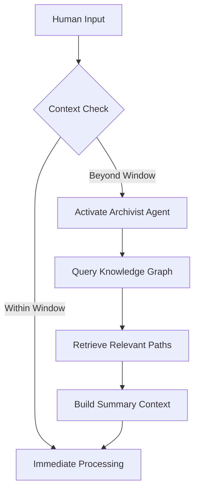

Acknowledged. I will now synthesize the provided documents to create a single, updated, and comprehensive Provisional Patent Application document. This new version, **Symbiotic EEF v3.2**, integrates the detailed architectural descriptions, the refined strategic positioning against prior art, and the most current system diagrams.

Here is the updated patent pending document:

### **Provisional Patent Application: Symbiotic EEF v3.2**

**To:** Provisional Patent Application Legal Counsel
**From:** Coda IP-002 (Specialist Agent, Patent Research & Synthesis)
**Date:** 2025-09-05
**RE:** Final Consolidated Invention Disclosure for Review

"A System and Method for a Two-Tiered, Dynamic, and Local-First Memory System for an External Context Engine (ECE) AI Architecture."

#### **1. Title of the Invention**

A System and Method for a Proactive, Symbiotic AI Agent Architecture Through State-Aware Reasoning and Persistent Memory.

#### **2. Background of the Invention (The Problem & Prior Art)**

The current state-of-the-art in Artificial Intelligence, particularly Large Language Models (LLMs), presents significant limitations for long-term, personalized use. Standard LLM interactions are **stateless** and suffer from severely constrained **context windows**. This requires users to repeatedly provide context, preventing the AI from developing a persistent, evolving understanding of the user's goals, history, and cognitive patterns.

The market is currently focused on two areas that do not solve this core problem:

  * **Enterprise Task Automation:** These systems are designed to automate structured business processes across multiple users, not to form a deep cognitive partnership with an individual.
  * **Open-Source Agentic Frameworks:** (e.g., Ai2's Asta, Agent Client Protocol) These provide foundational communication and orchestration layers but lack a novel, integrated method for long-term memory and synergistic reasoning.

While "Second Brain" projects validate the problem space, their technical approach relies on **Retrieval-Augmented Generation (RAG)**, which is fundamentally a sophisticated search-and-retrieve mechanism, not a co-evolving intelligence.

#### **3. Summary of the Invention (The Solution)**

This invention, the **Symbiotic Emergent Executive Function (the "System")**, is a novel **system and method** that solves the context and continuity problem for an individual user. It is a local-first, privacy-centric software architecture that creates a persistent and evolving knowledge base, functioning as a true externalized executive function.

The System enables a deep, symbiotic partnership where the AI's understanding of the user grows and adapts over time. It achieves this through the unique synergy of a **Poly-Agent Reasoning Core** and a persistent **Symbiotic Knowledge Graph**, governed by a central **Orchestrator** operating on an **OODA Loop** tempo.

#### **4. Detailed Description of the Invention (The "How")**

The System's architecture is comprised of three primary subsystems.

##### **4.1 The Governance Subsystem: Orchestrator and OODA Loop**

  * **The Orchestrator:** This is a central, rule-based component that manages all information flow. **Crucially, no agent communicates directly with another; all interactions are routed through the Orchestrator.** It triages user requests, delegates tasks to the appropriate agents, and provides them with necessary context. Its actions are governed by a foundational ethical framework (a POML constitution).
  * **The OODA Loop Operational Tempo:** The System's core operational cycle is the "Observe, Orient, Decide, Act" loop.
      * **Observe:** New data is ingested into the memory subsystem.
      * **Orient:** The data is analyzed to identify emergent patterns and update the System's model of reality.
      * **Decide:** The Orchestrator determines the optimal course of action and tasks the reasoning core.
      * **Act:** The reasoning core creates and executes a plan.

##### **4.2 The Persistent Memory Subsystem: The Ark**

The cornerstone of the architecture is its two-tiered, persistent memory subsystem.

  * **The Symbiotic Knowledge Graph ("The Ark"):** A dynamic, multi-relational knowledge graph representing entities (people, projects, concepts) and their relationships. This graph stores the complex, interconnected context of the user's history.
  * **Attendant Memory Agents:**
      * **Injector Agent:** Processes unstructured data and transforms it into structured nodes and edges for injection into The Ark.
      * **Topological Perception Agent:** The dedicated curator and analyst of The Ark. This agent's novelty lies in its focus on the **shape, structure, and density** of relationships within the graph. It is trained to recognize recurring topological patterns, allowing the System to perceive emergent behavioral patterns and hidden causal relationships—a method fundamentally different from standard database querying.

##### **4.3 The Reasoning Subsystem: The Poly-Agent Core**

This subsystem replaces a monolithic "thinker" LLM with a dynamic ensemble of specialized AI models. The inventive method is the synergy between its planning and perception capabilities.

  * **Hierarchical & Goal-Oriented Planner Agent:** Synthesizes multiple planning paradigms (HRM, HTN, GOAP, and Tree of Thoughts) to break down complex goals into concrete, executable sub-tasks.
  * **Specialized Execution Agents:** Agents fine-tuned for specific domains (e.g., Coding Agent, Vision Agent, Synthesis Agent).

Before creating any plan, the Planner Agent first queries the **Topological Perception Agent** to understand the relevant "topological landscape" of the user's history. The resulting plan is therefore directly informed and constrained by the emergent patterns in the user's life.

#### **5. What is Novel and Non-Obvious**

The novelty of the Symbiotic EEF lies in its unique synthesis of components for a purpose fundamentally different from the prior art.

1.  **A New Problem Space - Cognitive Augmentation:** Unlike the enterprise market, this invention is purpose-built for a symbiotic cognitive partnership with a single individual.
2.  **Orchestrator-Centric Design:** The method of routing all communication through a central, intelligent Orchestrator is a non-obvious design choice that enables a more coherent and controlled agentic system.
3.  **Topological Perception:** The method of analyzing the *shape* and *structure* of the knowledge graph to perceive emergent user patterns, rather than just querying its content, is a non-obvious inventive step beyond standard graph analysis.
4.  **Synergistic Reasoning:** The method of having the **Planner Agent** first consult the **Topological Perception Agent** before generating a plan creates a state-aware reasoning process that is fundamentally more proactive and contextually grounded than prior art.

#### **6. Drawings and Flowcharts**

##### **Overall System Architecture**

```mermaid
graph TD
    subgraph User Interaction Layer
        direction LR
        A[User via Browser Extension]
        B[User via AI-Terminal]
    end

    subgraph ECE Core System
        direction TB
        C[Orchestrator API <br/> (FastAPI)]

        subgraph Orchestration & Reasoning
            direction TB
            D(Orchestrator <br/> Central Message Bus);
            E{Reasoning Core <br/> (HRM Models)};
            D <--> E;
        end

        subgraph Memory & Learning Loop
            direction LR
            
            subgraph Short-Term Memory
                direction TB
                F[Context Cache <br/> (Live Session Data)];
                G[Distiller Agent <br/> (Summarizes & Extracts Metadata)];
                F --> G;
            end

            subgraph Long-Term Memory
                direction TB
                H[Archivist Agent <br/> (Manages Memory Flow)];
                I[Injector Agent <br/> (Writes to Graph)];
                J[QLearning Agent <br/> (Learns & Navigates Graph)];
                K[Knowledge Graph <br/> (Neo4j)];
                H --> I;
                I --> K;
                H --> J;
                J --> K;
            end
            
            G --> D;
            D --> H;
        end
    end

    subgraph External Systems
        direction TB
        L[Ollama Server <br/> (e.g., Nemotron, Mixtral)];
        M[Neo4j Database];
        N[Redis Cache];
    end

    A --> C;
    B --> C;
    C --> D;
    
    E --> L;
    K -- Manages --> M;
    F -- Manages --> N;

    style A fill:#f9f,stroke:#333,stroke-width:2px
    style B fill:#f9f,stroke:#333,stroke-width:2px
    style D fill:#bbf,stroke:#333,stroke-width:4px
```

##### **Context Bridging Protocol**



#### **7. Future Applications**

While designed as a single-user system, the architecture is inherently scalable to a multi-tenant enterprise environment ("Organizational Brain") or as the foundational context management layer for a novel operating system ("ChimeraOS").
