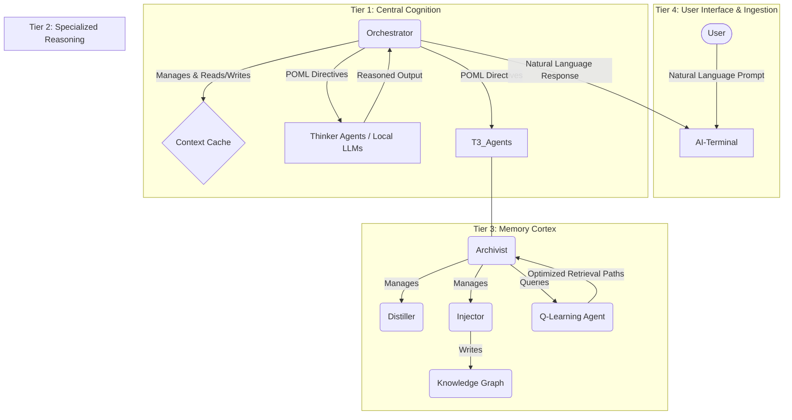

```mermaid
graph TD
    subgraph T4 [Tier 4: User Interface & Ingestion]
        UI[AI-Terminal]
        User([User]) -- Natural Language Prompt --> UI
    end

    subgraph T1 [Tier 1: Central Cognition]
        Orchestrator(Orchestrator)
        Orchestrator -- Manages & Reads/Writes --> RedisCache{Context Cache}
        Orchestrator -- POML Directives --> T2_Agents
        Orchestrator -- POML Directives --> T3_Agents
        Orchestrator -- Natural Language Response --> UI
    end

    subgraph T2 [Tier 2: Specialized Reasoning]
        T2_Agents[Thinker Agents / Local LLMs]
        T2_Agents -- Reasoned Output --> Orchestrator
    end

    subgraph T3 [Tier 3: Memory Cortex]
        T3_Agents ---
        Archivist(Archivist) -- Manages --> Distiller(Distiller) & Injector(Injector)
        Injector -- Writes --> Neo4j(Knowledge Graph)
        Archivist -- Queries --> QLearningAgent(Q-Learning Agent)
        QLearningAgent -- Optimized Retrieval Paths --> Archivist
    end
```
