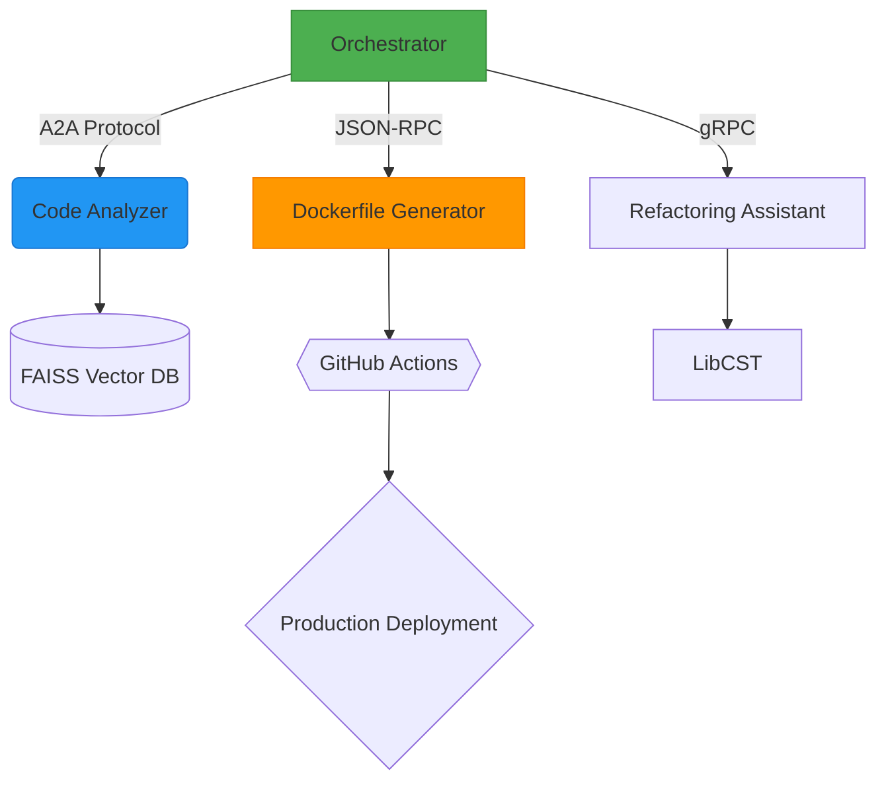

# AI Architect Execution Plan

#AIArchitecture #CareerDevelopment #TechnicalRoadmap #DevOps #PromptEngineering

## Phase 2: AI-Native Workflow Implementation (Weeks 1-8)

### RAG Pipeline Construction
1. **Core Components Setup**
   - [ ] Install Python 3.10 + LangChain 0.2.0
   - [ ] Configure FAISS vector store with HuggingFace embeddings
   - [ ] Implement document chunking strategy (512 token overlap)

2. **Prompt Engineering Framework**
   - [ ] Create persona template matching "Authentic Voice Mandate"
   ```python
   SYSTEM_PROMPT = '''
   You are Robert's architectural co-pilot. Respond with:
   - Concise technical analysis
   - Multiple implementation options
   - Risk assessments in table format
   '''
   ```
   - [ ] Build prompt versioning system using git-lfs

3. **Validation Pipeline**
   - [ ] Implement automated testing with pytest:
   ```bash
   pip install pytest
   mkdir tests/ && touch tests/test_rag_accuracy.py
   ```

## Phase 3: Autonomous Refactor Agent (Weeks 9-16)

### System Architecture



### Tool Development Timeline
| Week | Tool                | Tech Stack          | Success Metric |
|------|---------------------|---------------------|----------------|
| 9-10 | Code Analyzer       | Tree-sitter, PyAST  | 90% lang ID    |
| 11-12| Dockerfile Generator| Jinja2 templates    | 100% valid YAML|
| 13-14| Refactoring Assistant | LibCST, mypy      | 30% LOC reduction |

### Agent Orchestration
1. **Framework Selection Criteria**
   - [ ] Evaluate LangGraph vs CrewAI using decision matrix:
   ```markdown
   - Containerization Support [LangGraph: ✅, CrewAI: ❌]
   - A2A Protocol Compliance [Both: Partial]
   ```

2. **CI/CD Pipeline**
   - [ ] GitHub Actions workflow for agent testing:
   ```yaml
   name: Agent Validation
   on: [push]
   jobs:
     analyze:
       runs-on: ubuntu-latest
       steps:
         - uses: actions/checkout@v4
         - run: pytest --cov=agent --cov-report=xml
   ```

## Phase 4: Warp Integration Prep (Weeks 17-24)

### Performance Optimization
- [ ] Implement benchmarking suite using Locust
- [ ] Profile memory usage with py-spy
- [ ] Explore WASM compilation via Pyodide

### Resource Integration
- [ ] Add reference section with key resources:
   ```markdown
   - [Agent2Agent Protocol Specs](https://share.google/nlIxXz920OsKiP0UU)
   - [RAG Best Practices](https://share.google/0EJDHVC399Hp5dAJh)
   - [Production Docker Patterns](https://share.google/rAePqUC46T1F2jXCr)
   ```
