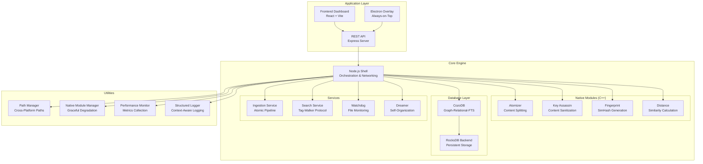
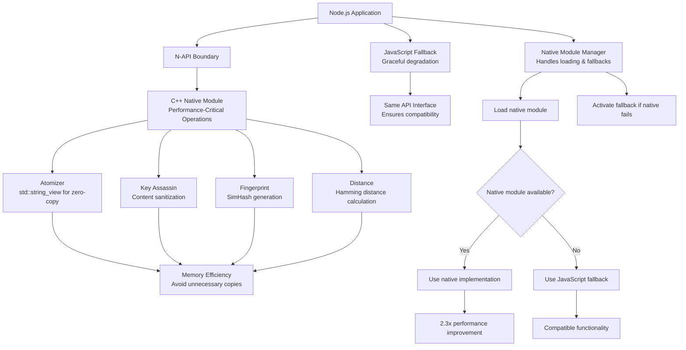
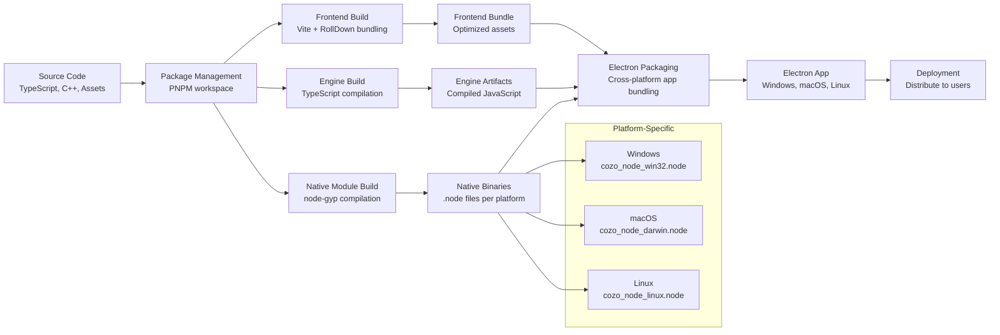

# ECE_Core Architecture Diagrams

## 1. Overall System Architecture



## 2. Atomic Architecture Flow

```mermaid
flowchart TD
    A[Raw Content<br/>Text File, Code, etc.] --> B{Content Type}
    
    B -->|Prose| C[Prose Processing<br/>Sentence Splitting]
    B -->|Code| D[Code Processing<br/>AST-based Splitting]
    B -->|Data| E[Data Processing<br/>Row/Line Splitting]
    
    C --> F[Sanitization<br/>Key Assassin Protocol]
    D --> F
    E --> F
    
    F --> G[Semantic Analysis<br/>Entity Extraction]
    G --> H[Semantic Categorization<br/>Relationship/Narrative/Technical Tags]
    
    H --> I[Compound Creation<br/>ID: comp_[hash of content+path]<br/>Contains full content]
    I --> J[Molecule Extraction<br/>Semantic Segments<br/>with byte coordinates]
    
    J --> K[Molecule 1<br/>ID: mol_[hash]<br/>Content: [segment text]<br/>Start: [byte offset]<br/>End: [byte offset]<br/>Type: prose/code/data<br/>Sequence: 0]
    
    J --> L[Molecule 2<br/>ID: mol_[hash]<br/>Content: [segment text]<br/>Start: [byte offset]<br/>End: [byte offset]<br/>Type: prose/code/data<br/>Sequence: 1]
    
    J --> M[Other Molecules<br/>...]
    
    G --> N[System Atoms<br/>#project, #src, #code, etc.]
    H --> O[Semantic Atoms<br/>#Relationship, #Narrative, etc.]
    K --> P[K-Molecule Atoms<br/>Specific entities in segment]
    L --> Q[L-Molecule Atoms<br/>Specific entities in segment]
    M --> R[Other Molecule Atoms<br/>...]
    
    I --> S[Compound Atoms<br/>Aggregated from all molecules]
    I --> T[Compound Molecules<br/>IDs of all molecules]
    
    K --> U[Molecule-Compound Link<br/>compoundId reference]
    L --> U
    M --> U
    
    N --> V[Atom Deduplication<br/>Remove duplicates across system]
    O --> V
    P --> V
    Q --> V
    R --> V
    
    V --> W[Final Atoms<br/>Unique atom IDs with labels]
    
    I --> X{Persist to Database}
    K --> X
    L --> X
    M --> X
    W --> X
    
    X --> Y[CozoDB Tables:<br/>- compounds table<br/>- molecules table<br/>- atoms table<br/>- atom_edges table]
```

## 3. Tag-Walker Search Protocol

```mermaid
graph LR
    A[User Query<br/>"Rob and Jade relationship"] --> B[Natural Language Parsing<br/>Extract Entities & Temporal Context]
    
    B --> C[Query Expansion<br/>NLP-based tag extraction]
    
    C --> D[Phase 1: Anchor Search<br/>70% of token budget<br/>Direct FTS matches]
    
    D --> E[Retrieve Top Molecules<br/>Based on FTS relevance]
    
    E --> F[Phase 2: Graph Walk<br/>30% of token budget<br/>Shared tag/bucket neighbors]
    
    F --> G[Retrieve Associative Neighbors<br/>Molecules sharing tags but lacking keywords]
    
    G --> H[Semantic Category Filtering<br/>Apply #Relationship, #Narrative, etc.]
    
    H --> I[Entity Co-occurrence Detection<br/>Boost molecules with multiple entities]
    
    I --> J[Provenance Boosting<br/>Sovereign content gets 2-3x boost]
    
    J --> K[Active Cleansing<br/>SimHash deduplication]
    
    K --> L[Context Inflation<br/>Combine adjacent molecules]
    
    L --> M[Final Results<br/>Ranked by composite score]
    
    M --> N[Return to LLM<br/>For reasoning and response]
```

## 4. Native Module Integration



## 5. Build & Deployment Pipeline

