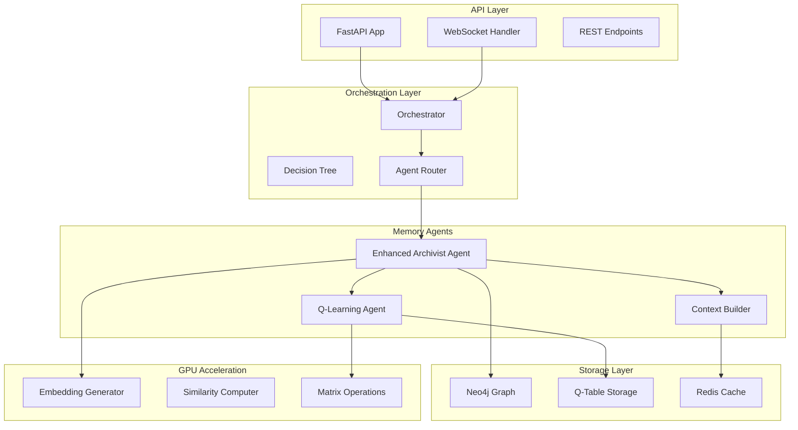
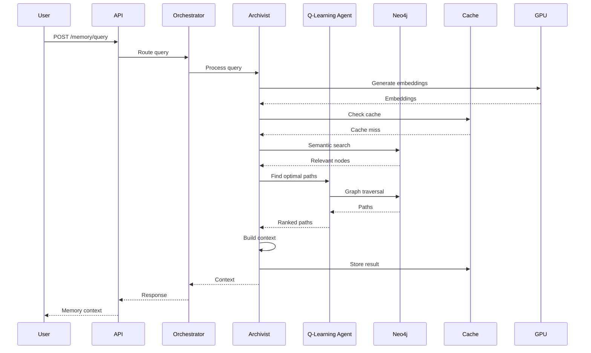
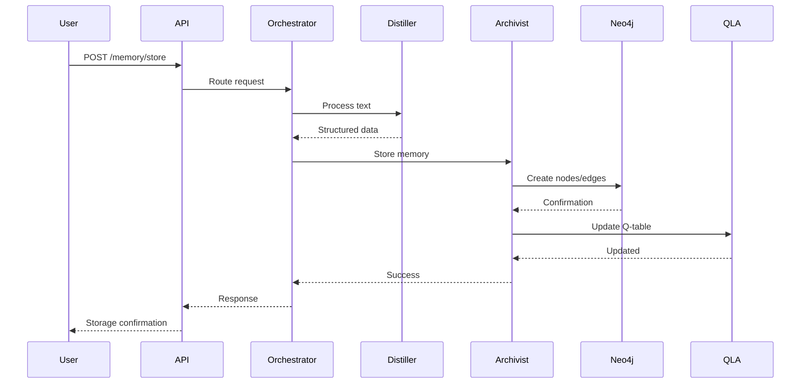

# Technical Implementation Plan: ECE Memory Management System

**Plan ID:** ECE-MMS-IMPL-001  
**Version:** 1.0.0  
**Created:** 2025-09-03  
**Status:** DRAFT  
**Author:** Coda-SpecKit-001 (Following GitHub Spec-Kit Methodology)

---

## 📐 Architecture Overview

The Memory Management System implementation follows a modular, event-driven architecture that integrates seamlessly with the existing Orchestrator-centric design. The system leverages GPU acceleration for compute-intensive operations while maintaining compatibility with the current FastAPI infrastructure.

### High-Level Component Architecture



---

## 🛠️ Technology Stack

### Core Technologies

| Component | Technology | Version | Justification |
|-----------|------------|---------|---------------|
| **Web Framework** | FastAPI | 0.104.x | Existing, async support, WebSocket native |
| **Graph Database** | Neo4j | 5.x | Already configured, excellent graph traversal |
| **Cache Layer** | Redis | 7.x | High-performance, supports complex data structures |
| **ML Framework** | PyTorch | 2.1.x | CUDA support, efficient tensor operations |
| **LLM Integration** | Ollama | Latest | Configured in .env, local model hosting |
| **Message Queue** | Redis Streams | 7.x | Lightweight, integrated with cache |
| **Embeddings** | Sentence-Transformers | 2.x | GPU-accelerated, semantic similarity |
| **Monitoring** | Prometheus | 2.x | Metrics collection and alerting |

### Python Dependencies

```python
# Core Dependencies
fastapi==0.104.1
uvicorn[standard]==0.24.0
websockets==12.0
pydantic==2.5.0

# Database & Cache
neo4j==5.15.0
redis[hiredis]==5.0.1
py2neo==2021.2.3  # For advanced graph operations

# Machine Learning
torch==2.1.2+cu121  # CUDA 12.1 version for RTX 4090
numpy==1.24.3
scikit-learn==1.3.2
sentence-transformers==2.2.2

# Q-Learning
gymnasium==0.29.1  # For RL environment
stable-baselines3==2.2.1  # Q-Learning implementation

# Utilities
python-dotenv==1.0.0
pyyaml==6.0.1
structlog==23.2.0  # Structured logging
tenacity==8.2.3  # Retry logic
```

---

## 🏗️ Detailed Component Design

### 1. Enhanced Archivist Agent

#### 1.1 Architecture
```python
class EnhancedArchivistAgent:
    def __init__(self, llm, neo4j_manager, q_learning_agent, cache_manager):
        self.llm = llm
        self.graph_db = neo4j_manager
        self.qla = q_learning_agent
        self.cache = cache_manager
        self.embedder = SentenceTransformer('all-MiniLM-L6-v2').cuda()
        
    async def process_query(self, query: str) -> MemoryContext:
        # 1. Parse query and extract concepts
        concepts = await self._extract_concepts(query)
        
        # 2. Generate embeddings (GPU accelerated)
        embeddings = self.embedder.encode(concepts, convert_to_tensor=True)
        
        # 3. Find relevant nodes in graph
        nodes = await self._semantic_search(embeddings)
        
        # 4. Task Q-Learning Agent for optimal paths
        paths = await self.qla.find_paths(nodes)
        
        # 5. Build context from paths
        context = await self._build_context(paths)
        
        return context
```

#### 1.2 Key Methods
- `_extract_concepts()`: NER using LLM for concept extraction
- `_semantic_search()`: GPU-accelerated vector similarity search
- `_build_context()`: Token-aware summarization
- `_cache_result()`: Store frequently accessed results

### 2. Q-Learning Agent Implementation

#### 2.1 Architecture
```python
class QLearningGraphAgent:
    def __init__(self, graph_manager, config):
        self.graph = graph_manager
        self.q_table = QTable(persist_path="./data/q_table.npy")
        self.learning_rate = config.learning_rate
        self.discount_factor = config.discount_factor
        self.epsilon = config.epsilon
        
    def find_paths(self, start_nodes, end_nodes=None, max_hops=5):
        """Find optimal paths using Q-values"""
        paths = []
        for start in start_nodes:
            if end_nodes:
                # Directed search
                for end in end_nodes:
                    path = self._q_guided_search(start, end, max_hops)
                    paths.append(path)
            else:
                # Exploratory search
                explored = self._explore_neighborhood(start, max_hops)
                paths.extend(explored)
        return self._rank_paths(paths)
        
    def update_q_values(self, path, reward):
        """Update Q-table based on path success"""
        for i in range(len(path) - 1):
            state = path[i]
            action = path[i + 1]
            self.q_table.update(state, action, reward)
```

#### 2.2 Q-Table Storage
- Memory-mapped numpy array for persistence
- Sparse matrix representation for efficiency
- GPU tensor operations for batch updates

### 3. Context Builder

#### 3.1 Architecture
```python
class ContextBuilder:
    def __init__(self, llm, tokenizer):
        self.llm = llm
        self.tokenizer = tokenizer
        self.max_tokens = 4096
        
    async def build_context(self, memory_paths: List[Path]) -> str:
        # 1. Extract information from each node
        node_info = self._extract_node_information(memory_paths)
        
        # 2. Rank by relevance and recency
        ranked_info = self._rank_information(node_info)
        
        # 3. Progressive summarization
        context = await self._progressive_summarize(ranked_info)
        
        # 4. Ensure token compliance
        context = self._enforce_token_limit(context)
        
        return context
```

### 4. Query Interface API

#### 4.1 REST Endpoints
```python
@app.post("/memory/query")
async def query_memory(request: MemoryQueryRequest) -> MemoryResponse:
    """Execute memory retrieval query"""
    context = await archivist.process_query(request.query)
    return MemoryResponse(
        context=context.summary,
        relevance_score=context.score,
        paths_explored=len(context.paths),
        tokens_used=context.token_count
    )

@app.post("/memory/store")
async def store_memory(request: MemoryStoreRequest) -> StoreResponse:
    """Store new memory in graph"""
    # Process through Distiller first
    structured = await distiller.process(request.raw_text)
    # Store via Archivist
    result = await archivist.store(structured)
    return StoreResponse(node_ids=result.nodes, relationship_ids=result.edges)

@app.get("/memory/stats")
async def get_stats() -> GraphStats:
    """Return graph statistics"""
    return await graph_manager.get_statistics()

@app.websocket("/memory/stream")
async def memory_stream(websocket: WebSocket):
    """Real-time memory updates"""
    await websocket.accept()
    async for message in memory_event_stream:
        await websocket.send_json(message)
```

### 5. GPU Acceleration Strategy

#### 5.1 CUDA Operations
```python
class GPUAccelerator:
    def __init__(self):
        self.device = torch.device("cuda:0")
        torch.cuda.set_device(self.device)
        
    def batch_embeddings(self, texts: List[str], batch_size=32):
        """Generate embeddings in batches on GPU"""
        with torch.cuda.amp.autocast():  # Mixed precision
            embeddings = []
            for i in range(0, len(texts), batch_size):
                batch = texts[i:i+batch_size]
                batch_emb = self.model.encode(batch, convert_to_tensor=True)
                embeddings.append(batch_emb)
        return torch.cat(embeddings)
        
    def similarity_matrix(self, embeddings_a, embeddings_b):
        """Compute similarity matrix on GPU"""
        return torch.nn.functional.cosine_similarity(
            embeddings_a.unsqueeze(1),
            embeddings_b.unsqueeze(0),
            dim=2
        )
```

### 6. Caching Strategy

#### 6.1 Multi-Level Cache
```python
class CacheManager:
    def __init__(self, redis_client):
        self.redis = redis_client
        self.local_cache = LRUCache(maxsize=1000)
        
    async def get(self, key: str):
        # L1: Local memory cache
        if key in self.local_cache:
            return self.local_cache[key]
            
        # L2: Redis cache
        value = await self.redis.get(key)
        if value:
            self.local_cache[key] = value
            return value
            
        return None
        
    async def set(self, key: str, value: Any, ttl: int = 3600):
        self.local_cache[key] = value
        await self.redis.setex(key, ttl, pickle.dumps(value))
```

---

## 📊 Data Flow Diagrams

### Memory Query Flow


### Memory Storage Flow


---

## 🚀 Implementation Phases

### Phase 3.1: Foundation (Week 1-2)
1. **Database Setup**
   - Configure Neo4j with proper indices
   - Setup Redis for caching
   - Initialize Q-table storage structure

2. **Core Agent Refactoring**
   - Enhance existing Archivist stub
   - Integrate with Orchestrator's agent router
   - Add LLM injection to agents

3. **API Expansion**
   - Implement new REST endpoints
   - Setup WebSocket infrastructure
   - Add request/response models

### Phase 3.2: Q-Learning Implementation (Week 3-4)
1. **Q-Learning Agent Development**
   - Implement Q-table management
   - Create graph traversal algorithms
   - Setup training pipeline

2. **GPU Acceleration**
   - Configure PyTorch with CUDA
   - Implement embedding generation
   - Setup batch processing

3. **Integration Testing**
   - Test agent communication
   - Verify Q-learning convergence
   - Benchmark GPU operations

### Phase 3.3: Context Building (Week 5-6)
1. **Context Builder Implementation**
   - Token-aware summarization
   - Progressive compression
   - Chronological ordering

2. **Caching Layer**
   - Redis configuration
   - Cache warming strategies
   - TTL management

3. **Performance Optimization**
   - Query optimization
   - Batch processing
   - Connection pooling

### Phase 3.4: Production Readiness (Week 7-8)
1. **Error Handling**
   - Retry mechanisms
   - Graceful degradation
   - Circuit breakers

2. **Monitoring & Metrics**
   - Prometheus integration
   - Custom metrics
   - Alerting setup

3. **Documentation & Testing**
   - API documentation
   - Integration tests
   - Performance benchmarks

---

## 🎯 Performance Targets

### Latency Targets
| Operation | P50 | P95 | P99 |
|-----------|-----|-----|-----|
| Query Processing | 200ms | 500ms | 1s |
| Memory Storage | 50ms | 100ms | 200ms |
| Path Finding | 100ms | 300ms | 500ms |
| Context Building | 150ms | 300ms | 500ms |
| Cache Hit | 5ms | 10ms | 20ms |

### Throughput Targets
- **Queries per Second**: 100 QPS sustained
- **Batch Processing**: 10,000 memories/minute
- **WebSocket Connections**: 1,000 concurrent
- **Graph Operations**: 1,000 ops/second

### Resource Utilization Targets
- **GPU Utilization**: 60-80% during peak
- **RAM Usage**: 32GB allocated cache pool
- **CPU Cores**: 8 cores at 70% utilization
- **Neo4j Connection Pool**: 50 connections

---

## 🧪 Testing Strategy

### Unit Testing
```python
# Example test structure
class TestArchivistAgent:
    def test_concept_extraction(self):
        """Test NER and concept extraction"""
        
    def test_path_finding(self):
        """Test Q-learning path discovery"""
        
    def test_context_building(self):
        """Test token-aware summarization"""
```

### Integration Testing
- Agent communication tests
- Database transaction tests
- Cache coherency tests
- WebSocket event tests

### Performance Testing
```python
# Locust configuration for load testing
from locust import HttpUser, task, between

class MemoryUser(HttpUser):
    wait_time = between(1, 3)
    
    @task
    def query_memory(self):
        self.client.post("/memory/query", json={
            "query": "What did we discuss about architecture?"
        })
```

### Benchmarking Suite
- Graph traversal benchmarks
- Embedding generation benchmarks
- Serialization benchmarks
- Cache performance benchmarks

---

## 🔒 Security Considerations

### API Security
- Rate limiting: 100 requests/minute per IP
- Request validation with Pydantic
- SQL injection prevention (Cypher parameterization)
- WebSocket authentication tokens

### Data Security
- Environment variable management
- Secrets never in logs
- Encrypted Redis connection
- Neo4j authentication

### Memory Isolation
- User context separation (future)
- Memory access control lists
- Audit logging for all operations

---

## 📈 Monitoring & Observability

### Metrics Collection
```python
# Prometheus metrics
from prometheus_client import Counter, Histogram, Gauge

query_counter = Counter('memory_queries_total', 'Total memory queries')
query_duration = Histogram('memory_query_duration_seconds', 'Query duration')
graph_size = Gauge('knowledge_graph_nodes', 'Number of nodes in graph')
cache_hit_rate = Gauge('cache_hit_rate', 'Cache hit rate')
```

### Logging Strategy
```python
import structlog

logger = structlog.get_logger()

logger.info(
    "memory_query_processed",
    query_id=query_id,
    duration_ms=duration,
    paths_explored=len(paths),
    cache_hit=cache_hit
)
```

### Health Checks
```python
@app.get("/health")
async def health_check():
    return {
        "status": "healthy",
        "neo4j": await check_neo4j(),
        "redis": await check_redis(),
        "gpu": torch.cuda.is_available()
    }
```

---

## 🔄 Migration Path

### Step 1: Parallel Development
- Develop new components alongside existing system
- Use feature flags for gradual rollout
- Maintain backwards compatibility

### Step 2: Data Migration
```python
# Migration script for existing data
async def migrate_combined_text():
    with open("combined_text.txt", "r") as f:
        content = f.read()
    
    # Process in chunks
    chunks = split_into_chunks(content, chunk_size=1000)
    for chunk in chunks:
        structured = await distiller.process(chunk)
        await archivist.store(structured)
```

### Step 3: Gradual Cutover
- Route 10% traffic to new system
- Monitor metrics and errors
- Increase traffic gradually
- Full cutover at 100% confidence

---

## 📝 Configuration Management

### Environment Configuration
```yaml
# config.yaml additions
memory_management:
  cache:
    redis_url: "redis://localhost:6379"
    ttl_seconds: 3600
    max_size_mb: 32768
  
  q_learning:
    learning_rate: 0.1
    discount_factor: 0.9
    epsilon: 0.1
    max_episodes: 1000
  
  gpu:
    device: "cuda:0"
    batch_size: 32
    mixed_precision: true
  
  performance:
    max_concurrent_queries: 100
    query_timeout_seconds: 5
    cache_warmup_on_start: true
```

---

## 🚦 Risk Mitigation

### Technical Risks
| Risk | Impact | Mitigation |
|------|--------|------------|
| Neo4j performance degradation | High | Implement sharding strategy |
| GPU memory overflow | Medium | Batch size auto-adjustment |
| Q-Learning non-convergence | Medium | Hyperparameter tuning |
| Cache invalidation issues | Low | TTL-based expiration |

### Operational Risks
- **Single point of failure**: Implement redundancy
- **Data loss**: Regular backups of Neo4j and Q-table
- **Resource exhaustion**: Circuit breakers and rate limiting

---

## ✅ Success Criteria

### Technical Success
- [ ] All P0 acceptance criteria met
- [ ] Performance targets achieved
- [ ] 95% test coverage
- [ ] Zero critical security issues

### Operational Success
- [ ] Deployment automation complete
- [ ] Monitoring dashboards operational
- [ ] Documentation complete
- [ ] Team trained on new system

---

**Plan Status**: COMPLETE  
**Review Status**: Pending Architect Approval  
**Next Step**: Generate `/tasks` - Detailed Task Breakdown

<citations>
<document>
    <document_type>RULE</document_type>
    <document_id>gQ24bqbKrTVHP8HynVeHcE</document_id>
</document>
</citations>
