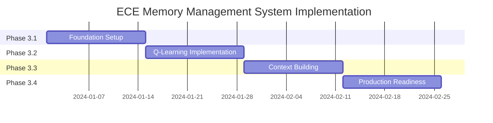

# Implementation Roadmap: ECE Memory Management System

**Roadmap ID:** ECE-MMS-ROADMAP-001  
**Version:** 1.0.0  
**Created:** 2025-09-03  
**Duration:** 8 weeks  
**Start Date:** [To be determined]  
**Author:** Coda-SpecKit-001

---

## 🎯 Executive Summary

This roadmap provides a complete implementation guide for the ECE Memory Management System (Phase 3). The project will deliver an intelligent Archivist Agent with Q-Learning powered memory retrieval, enabling persistent context management for AI systems.

### Key Deliverables
- **Enhanced Archivist Agent** with semantic memory retrieval
- **Q-Learning Agent** for optimal path finding
- **Query Interface API** with REST and WebSocket support
- **GPU-Accelerated** embedding and similarity computation
- **Production-Ready** deployment with monitoring

---

## 📅 Implementation Timeline



---

## 🚀 Week-by-Week Milestones

### Week 1-2: Foundation (Phase 3.1)
**Milestone:** Core infrastructure operational

#### Week 1 Deliverables
- [ ] Neo4j and Redis running in Docker
- [ ] GPU environment configured (CUDA + PyTorch)
- [ ] Project structure initialized
- [ ] Environment variables configured

#### Week 2 Deliverables
- [ ] Archivist Agent enhanced with async support
- [ ] Orchestrator executing agents (not just returning text)
- [ ] Memory API endpoints functional
- [ ] WebSocket infrastructure ready

**Success Criteria:**
- Can store and retrieve simple memories
- Orchestrator successfully routes to agents
- All infrastructure services healthy

### Week 3-4: Q-Learning (Phase 3.2)
**Milestone:** Intelligent path finding operational

#### Week 3 Deliverables
- [ ] Q-Learning Agent class implemented
- [ ] Q-Table with persistence functional
- [ ] Basic graph traversal working
- [ ] Training pipeline operational

#### Week 4 Deliverables
- [ ] GPU acceleration for embeddings
- [ ] Similarity computation on GPU
- [ ] Path optimization algorithms
- [ ] Integration tests passing

**Success Criteria:**
- Q-Learning converges within 1000 iterations
- GPU utilization reaches 60%+
- Path finding completes in <500ms

### Week 5-6: Context Building (Phase 3.3)
**Milestone:** Smart summarization and caching active

#### Week 5 Deliverables
- [ ] Context Builder with token awareness
- [ ] Progressive summarization working
- [ ] Redis caching integrated
- [ ] Cache warming implemented

#### Week 6 Deliverables
- [ ] Cypher query optimization
- [ ] Connection pooling configured
- [ ] Batch processing operational
- [ ] Performance benchmarks met

**Success Criteria:**
- Context fits within 4096 tokens
- Cache hit rate >60%
- Query latency P95 <2 seconds

### Week 7-8: Production (Phase 3.4)
**Milestone:** System production-ready

#### Week 7 Deliverables
- [ ] Retry mechanisms and circuit breakers
- [ ] Prometheus metrics collection
- [ ] Health check endpoints
- [ ] API documentation complete

#### Week 8 Deliverables
- [ ] Docker deployment ready
- [ ] Integration test suite complete
- [ ] Performance tests passing
- [ ] User documentation finalized

**Success Criteria:**
- 95% test coverage achieved
- All P0 tasks complete
- Performance targets met
- Zero critical bugs

---

## 🏃 Quick-Start Guide

### Prerequisites

#### System Requirements
```bash
# Hardware
- CPU: 8+ cores (i9-13900HX optimal)
- RAM: 64GB recommended, 32GB minimum
- GPU: NVIDIA RTX 4090 or similar (16GB VRAM)
- Storage: 100GB+ SSD space

# Software
- Linux (Debian/Ubuntu) or WSL2
- Docker & Docker Compose
- Python 3.11+
- CUDA Toolkit 12.1
- Git
```

#### Initial Setup
```bash
# 1. Clone repository
git clone https://github.com/yourusername/External-Context-Engine-ECE.git
cd External-Context-Engine-ECE

# 2. Create development branch
git checkout -b feature/memory-management-system

# 3. Setup Python environment
python3.11 -m venv venv
source venv/bin/activate  # On Windows: venv\Scripts\activate

# 4. Install dependencies
pip install -r requirements.txt

# 5. Configure environment
cp .env.example .env
# Edit .env with your configuration

# 6. Start infrastructure services
docker-compose up -d neo4j redis

# 7. Verify GPU setup
python -c "import torch; print(torch.cuda.is_available())"
```

### Development Workflow

#### Daily Development Cycle
```bash
# Morning setup
git pull origin main
docker-compose up -d
source venv/bin/activate

# Run tests before coding
pytest tests/

# Start development server
uvicorn src.external_context_engine.main:app --reload --port 8000

# Evening cleanup
pytest tests/
git add .
git commit -m "feat: [TASK-XXX] Description"
git push origin feature/memory-management-system
```

#### Task Implementation Pattern
```python
# 1. Create feature branch
git checkout -b task/TASK-XXX-description

# 2. Implement feature following TDD
# - Write test first
# - Implement feature
# - Refactor if needed

# 3. Run tests
pytest tests/test_your_feature.py -v

# 4. Submit PR
git push origin task/TASK-XXX-description
# Create PR on GitHub
```

---

## 📋 Pre-Implementation Checklist

### Environment Setup
- [ ] Docker Desktop installed and running
- [ ] Python 3.11+ verified (`python --version`)
- [ ] CUDA 12.1 installed (`nvidia-smi`)
- [ ] Neo4j accessible at http://localhost:7474
- [ ] Redis running (`docker ps | grep redis`)
- [ ] Ollama installed with model downloaded

### Configuration
- [ ] `.env` file configured with all variables
- [ ] `config.yaml` updated with memory_management section
- [ ] GPU memory allocation set (CUDA_MEMORY_FRACTION)
- [ ] Redis connection parameters configured
- [ ] Neo4j credentials set

### Development Tools
- [ ] VS Code or preferred IDE configured
- [ ] Python extension installed
- [ ] Docker extension installed
- [ ] Git configured with SSH keys
- [ ] Postman/Insomnia for API testing

---

## 🧪 Testing Checklist

### Unit Testing
```bash
# Run all unit tests
pytest tests/unit/ -v --cov=src

# Run specific test file
pytest tests/unit/test_archivist_agent.py -v

# Run with coverage report
pytest tests/unit/ --cov=src --cov-report=html
```

### Integration Testing
```bash
# Run integration tests
pytest tests/integration/ -v

# Test specific endpoint
pytest tests/integration/test_memory_api.py::test_query_endpoint
```

### Performance Testing
```bash
# Run Locust performance tests
locust -f tests/performance/locustfile.py --host=http://localhost:8000

# Benchmark GPU operations
python tests/performance/benchmark_gpu.py
```

### Manual Testing Checklist
- [ ] Store memory via POST /memory/store
- [ ] Query memory via POST /memory/query
- [ ] Check stats via GET /memory/stats
- [ ] Test WebSocket connection
- [ ] Verify GPU utilization during operations
- [ ] Monitor Redis cache hit rate
- [ ] Check Neo4j query performance

---

## 🚀 Deployment Instructions

### Local Development
```bash
# 1. Build Docker image
docker build -t ece-mms:latest .

# 2. Start all services
docker-compose up -d

# 3. Initialize database
python scripts/init_db.py

# 4. Run migrations
python scripts/migrate.py

# 5. Verify health
curl http://localhost:8000/health
```

### Production Deployment
```bash
# 1. Set production environment
export ENV=production

# 2. Build production image
docker build -f Dockerfile.prod -t ece-mms:prod .

# 3. Deploy with Docker Compose
docker-compose -f docker-compose.prod.yml up -d

# 4. Run smoke tests
pytest tests/smoke/ -v

# 5. Monitor logs
docker-compose logs -f
```

### Rollback Procedure
```bash
# 1. Stop current deployment
docker-compose down

# 2. Restore previous version
docker pull ece-mms:previous
docker tag ece-mms:previous ece-mms:latest

# 3. Restore database backup
neo4j-admin restore --from=/backups/latest.dump

# 4. Restart services
docker-compose up -d
```

---

## ⚡ Hardware Optimization Guidelines

### GPU Optimization
```python
# Configure for RTX 4090
import torch
torch.cuda.set_device(0)
torch.backends.cudnn.benchmark = True
torch.cuda.amp.autocast(enabled=True)  # Mixed precision

# Batch size optimization
OPTIMAL_BATCH_SIZE = 32  # For 16GB VRAM
```

### Memory Management
```python
# Configure cache pool
REDIS_CACHE_SIZE = 32 * 1024 * 1024 * 1024  # 32GB
LOCAL_CACHE_SIZE = 1000  # LRU entries

# Connection pooling
NEO4J_MAX_CONNECTIONS = 50
REDIS_MAX_CONNECTIONS = 100
```

### CPU Utilization
```python
# Multi-threading configuration
import os
os.environ['OMP_NUM_THREADS'] = '8'
os.environ['MKL_NUM_THREADS'] = '8'

# Async worker configuration
UVICORN_WORKERS = 8
```

---

## 📊 Progress Tracking Template

### Weekly Status Report
```markdown
## Week [X] Status Report

### Completed Tasks
- [x] TASK-XXX: Description (X hours)
- [x] TASK-YYY: Description (Y hours)

### In Progress
- [ ] TASK-ZZZ: Description (50% complete)

### Blockers
- Issue description and impact
- Proposed resolution

### Metrics
- Test Coverage: XX%
- Performance: XXms P95 latency
- GPU Utilization: XX%

### Next Week Focus
- Priority tasks for next week
```

### Daily Standup Template
```markdown
## Daily Standup - [Date]

### Yesterday
- Completed TASK-XXX
- Resolved blocker with Y

### Today
- Working on TASK-YYY
- Code review for PR #ZZ

### Blockers
- None / Description
```

---

## 🔗 Resource Links

### Documentation
- [Spec-Kit Methodology](https://github.com/github/spec-kit)
- [FastAPI Documentation](https://fastapi.tiangolo.com/)
- [Neo4j Python Driver](https://neo4j.com/docs/python-manual/current/)
- [PyTorch CUDA Guide](https://pytorch.org/docs/stable/cuda.html)

### Project Resources
- **Specifications**: `/specs/memory-management-system/`
- **API Documentation**: `http://localhost:8000/docs`
- **Monitoring Dashboard**: `http://localhost:3000` (Grafana)
- **Neo4j Browser**: `http://localhost:7474`

### Support Channels
- GitHub Issues: [Create Issue](https://github.com/yourusername/ECE/issues)
- Discord: [Project Discord](https://discord.gg/yourproject)
- Documentation Wiki: [Internal Wiki](https://wiki.yourproject.com)

---

## 🎉 Success Criteria

### Technical Success Metrics
- [ ] All P0 tasks complete (45/45)
- [ ] Test coverage >80%
- [ ] Performance targets met
  - Query latency P95 <2s
  - 100 QPS sustained
  - GPU utilization 60-80%
- [ ] Zero critical bugs
- [ ] API documentation complete

### Business Success Metrics
- [ ] Memory retrieval accuracy >85%
- [ ] Context relevance score >0.8
- [ ] System uptime >99.9%
- [ ] User satisfaction >4/5

### Team Success Metrics
- [ ] On-time delivery (8 weeks)
- [ ] Knowledge transfer complete
- [ ] Documentation approved
- [ ] Team trained on new system

---

## 📝 Final Notes

### Key Risks to Monitor
1. **Q-Learning Convergence**: Monitor training metrics daily
2. **GPU Memory**: Watch for OOM errors with large batches
3. **Neo4j Performance**: Index optimization critical at scale
4. **Cache Coherency**: Monitor invalidation patterns

### Optimization Opportunities
1. **Embedding Cache**: Pre-compute common embeddings
2. **Query Patterns**: Analyze and optimize frequent queries
3. **Batch Processing**: Group similar operations
4. **Connection Pooling**: Fine-tune pool sizes

### Future Enhancements (Post-MVP)
1. Multi-user support
2. Cloud deployment readiness
3. Advanced summarization strategies
4. Memory importance decay
5. Collaborative memory sharing

---

**Roadmap Status**: COMPLETE  
**Package Status**: READY FOR HANDOFF  
**Implementation**: BEGIN WHEN READY

## Appendix: Complete Specification Package

The following documents comprise the complete specification package:

1. **Current State Analysis**: `current-state-analysis.md`
2. **Feature Specification**: `feature-spec.md`
3. **Implementation Plan**: `implementation-plan.md`
4. **Task Breakdown**: `tasks.md`
5. **Validation Report**: `validation-report.md`
6. **Implementation Roadmap**: `implementation-roadmap.md` (this document)

All documents are located in `/specs/memory-management-system/`

---

<citations>
<document>
    <document_type>RULE</document_type>
    <document_id>gQ24bqbKrTVHP8HynVeHcE</document_id>
</document>
</citations>
