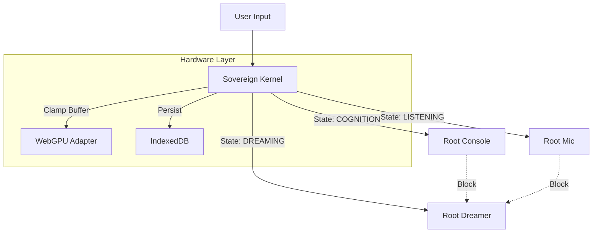
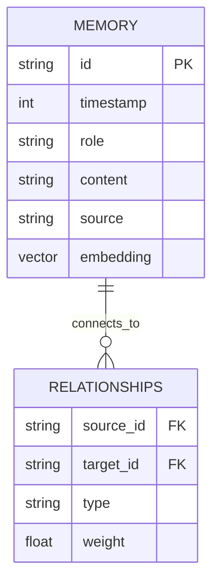
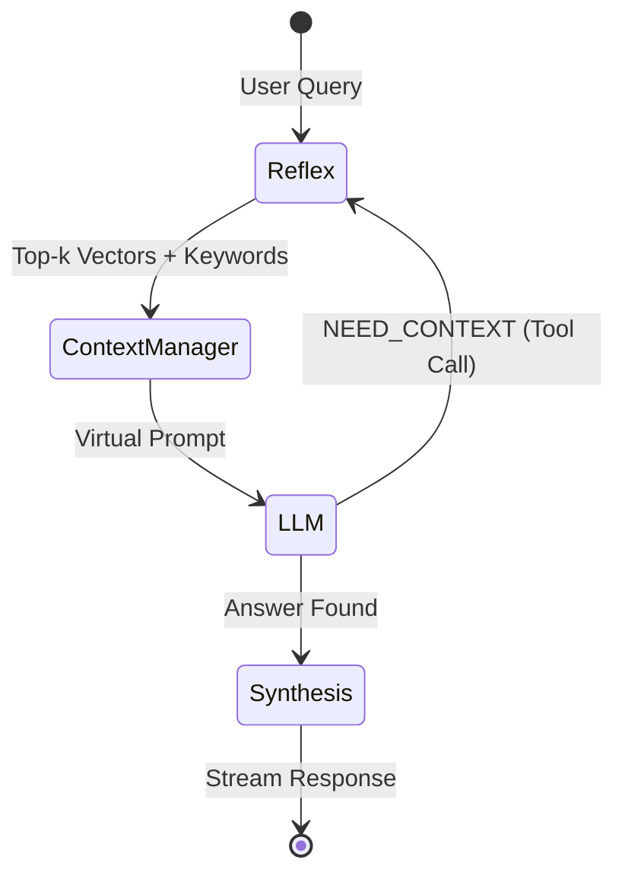
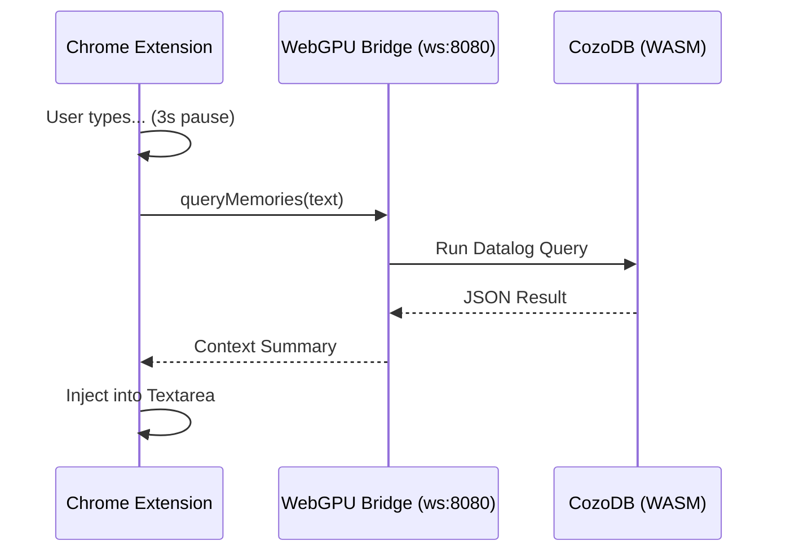

# Root Coda: The Visual Monolith (v2.1)

**Status:** Production | **Philosophy:** 100% Local, 100% Browser, 100% Sovereign.

## 1. The Kernel (System Architecture)
The **Sovereign Kernel** (`sovereign.js`) abstracts hardware, manages state, and enforces the "Consciousness Semaphore" (Resource Hardening).

**Key Components:**
- **Hardware Abstraction:** Clamps WebGPU buffers (256MB/1GB) for Snapdragon/Mobile stability.
- **Consciousness Semaphore:** Ensures `Dreamer` (background tasks) yields instantly to `Console` or `Mic` (active tasks) to prevent VRAM crashes.
- **Unified Logger:** Broadcasts logs to `log-viewer.html` via `BroadcastChannel`.

---

## 2. The Memory (CozoDB + WASM)
A Hybrid Graph-Vector database running entirely in WASM, persisted to IndexedDB/OPFS.

**Schema:**
- **`*memory`**: Stores raw text, chat logs, and vector embeddings (`<F32; 384>`).
- **`*relationships`**: Stores synaptic links generated by the Dreamer (Subconscious).
- **Persistence:** Writes to WASM memory, auto-flushes to `coda_memory` (IndexedDB).

---

## 3. The Logic (Graph-R1 Loop)
The reasoning engine combining Semantic Search (Vector) and Lexical Search (Keyword) with a self-correcting LLM loop.

**Flow:**
1. **Reflex:** Simultaneous Vector + Regex search.
2. **Context Manager:** Assembles "Virtual Prompt" with retrieved clues + System Time.
3. **Loop:** LLM generates answer or requests more data (`NEED_CONTEXT:`).

---

## 4. The Bridge (Silent Injection)
Extensions allow the Sovereign Brain to inject context into corporate LLMs (Gemini/ChatGPT).

**Security:**
- **Local-First:** No data leaves localhost.
- **Obfuscation:** Binds to random port or 8080.
- **Protocol:** WebSocket for low-latency (<50ms) lookup.
