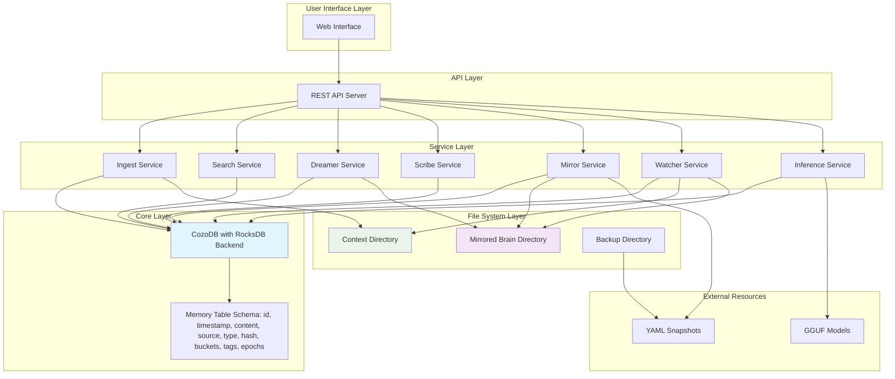
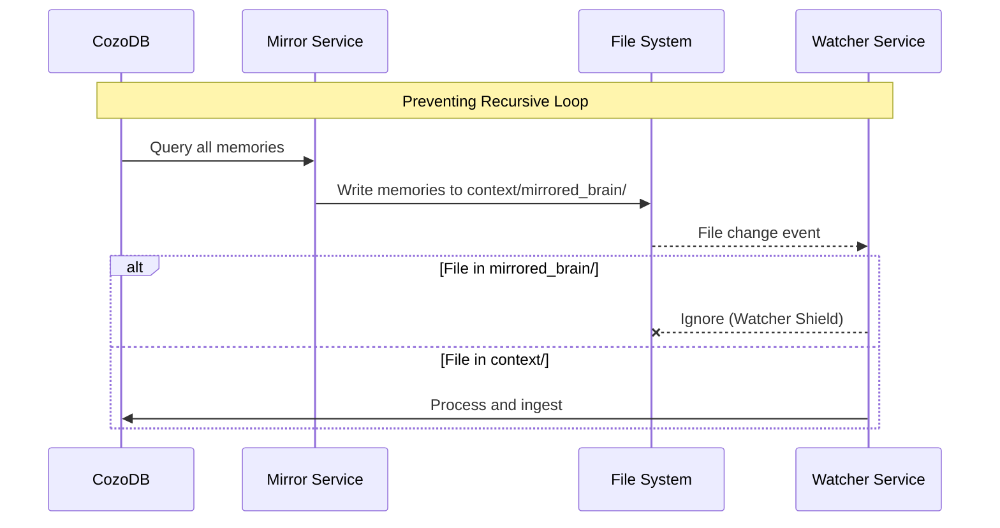
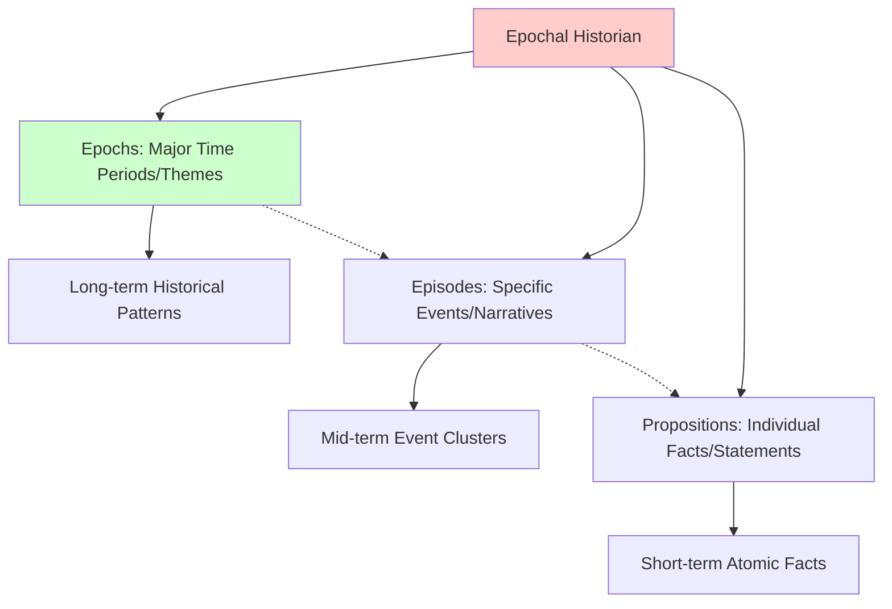

# ECE_Core Architecture Specification

## System Architecture Diagram

## Mirror Protocol Flow

## Deterministic Search Syntax

The system supports a deterministic search syntax with the following elements:

- **Quoted Phrases**: `"Project Sybil"` for exact phrase matching
- **Temporal Tags**: `@year` (e.g., `@2025`, `@---`) for temporal filtering
- **Bucket Tags**: `#work` for categorical filtering
- **Keywords**: General text matching
- **Combined Syntax**: `"Project Sybil" @2025 #work meeting notes`

## Mirror Protocol Workflow

The Mirror Protocol creates a bidirectional synchronization between the CozoDB graph and the filesystem:

### Filesystem Representation
- Creates files in `context/mirrored_brain/[Bucket]/[Epoch]/[Memory_ID].md`
- Files have appropriate extensions based on content type (.md, .json, .js, .py, etc.)
- Includes frontmatter with metadata (id, timestamp, date, source, type, hash, buckets, tags)
- Reflects the current database state when created

### Bidirectional Sync
- **Database → Filesystem**: On startup and during Dreamer cycles, database entries are mirrored to files
- **Filesystem → Database**: Changes to mirrored files are automatically synced back to the database
- **Deletion Sync**: Deleting a mirrored file removes the corresponding database entry

### Recursive Loop Prevention
The system implements a "Watcher Shield" to prevent recursive ingestion:
- The file watcher ignores the `context/mirrored_brain/` directory
- This prevents mirrored files from being re-ingested into the database
- Ensures the system doesn't enter an infinite loop

### Epoch-Based Structure Enhancement
- Prioritizes Epochs (e.g., `context/mirrored_brain/[Bucket]/[Epoch]/[Memory_ID].md`)
- Falls back to Year structure if no Epoch is assigned by the Dreamer
- Organizes memories hierarchically based on the Recursive Decomposition (Epochs -> Episodes -> Propositions)

## Recursive Decomposition (Epochs -> Episodes -> Propositions)

## Epochal Historian (Dreamer Service Enhancement)

The Dreamer service now includes an Epochal Historian that identifies and synthesizes historical patterns in the memory graph:

### Epoch Identification
- Analyzes memories chronologically to identify major time periods or themes
- Groups related memories into Epochs based on semantic similarity and temporal proximity
- Creates hierarchical organization: Epochs contain Episodes, which contain individual Propositions

### Episode Formation
- Clusters related memories within an Epoch based on topic, context, or relationship
- Forms coherent narrative threads within larger time periods
- Enables more granular organization within broader Epochs

### Proposition Capture
- Extracts individual facts, statements, or insights from memories
- Maintains atomic units of knowledge that can be referenced independently
- Preserves the original context and source information

### Implementation in Dreamer Service
- Runs periodically during background memory organization
- Uses local LLM to analyze and categorize memories
- Updates memory entries with epochal tags for improved organization and retrieval