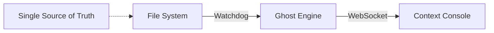

# Standard 023: Anchor Lite Architecture

## 1. What Happened
The system became overly complex with multiple database views (DB Builder, Memory Builder) and experimental chat interfaces, causing data synchronization issues and user confusion.

## 2. The Cost
- Loss of trust in retrieval ("Jade" not found).
- High maintenance overhead.

## 3. The Rule
**Single Pipeline Architecture:**

1. **Source:** File System (`context/` folder) is the Single Source of Truth.
2. **Ingest:** `watchdog.py` monitors files and pushes to the Engine.
3. **Index:** `ghost.html` (Headless CozoDB) maintains the index.
4. **Retrieve:** `context.html` is the sole interface for search.

## 4. Operational Procedures
1. **Startup Sequence:**
   - Launch `webgpu_bridge.py` first (provides API bridge)
   - Launch `anchor_watchdog.py` second (monitors files)
   - Ghost Engine should auto-launch via ResurrectionManager

2. **Connection Verification:**
   - Check that port 8000 is accessible
   - Verify Ghost Engine process is running (check resurrection.log)
   - Confirm WebSocket connection between browser and bridge is established
   - Test memory operations to ensure full functionality

3. **Logging Requirements:**
   - All scripts must output logs to the `logs/` directory
   - Log files must truncate after 5000 lines or 10000 characters
   - Scripts must run in detached mode to prevent blocking operations
   - All components must write to individual log files for debugging

4. **Troubleshooting Common Issues:**
   - If Ghost Engine shows as "disconnected", verify the WebSocket connection
   - Check that no other processes are using port 8000
   - Ensure watchdog dependencies (watchdog module) are installed
   - Review resurrection.log for browser launch issues
